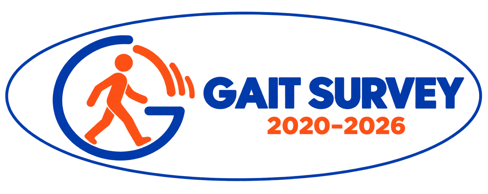

<p align="center">
  <a href="https://chaofan996.github.io/gait-survey/">
    
  </a>
</p>

<h1 align="center">Gait Research Library</h1>

<p align="center">
  An evolving companion to <strong>Gait Recognition: A Survey and Outlook</strong>.<br>
  Explore research ideas, compare benchmark evidence, and connect open questions.
</p>

<p align="center">
  <a href="https://chaofan996.github.io/gait-survey/"><strong>Explore the homepage</strong></a> ·
  <a href="CONTRIBUTING.md">Contribute</a> ·
  <a href="https://github.com/ChaoFan996/gait-survey/issues/new">Suggest a paper or correction</a>
</p>

## Explore

| View | What you can find | In the survey |
| --- | --- | --- |
| [Literature](https://chaofan996.github.io/gait-survey/) | **Why / What / How** summaries: Core Motivation, Key Idea, and Main Techniques | Research landscape |
| [Benchmarks](https://chaofan996.github.io/gait-survey/?view=benchmarks) | Within- and cross-domain results, training sources, protocols, and rankings | Tables III–IV |
| [Statistics](https://chaofan996.github.io/gait-survey/?view=statistics) | Dataset usage, modality trends, and benchmark resources | Table II · Figs. 5–6 |
| [Research map](https://chaofan996.github.io/gait-survey/?view=map) | Papers connected to five methodological dimensions, challenges, and outlooks | Sections IV–VI |

**Current collection:** 278 catalogue references · 120 experimental records, including alternative reports. Filters can be shared, and records can be exported for further analysis.

## Help the survey grow

**New papers, corrections, missing results, and fresh perspectives are welcome.** We invite researchers, students, practitioners, and first-time contributors to help keep this resource useful and current. Suggestions from different venues and research communities are welcome.

[Open an issue](https://github.com/ChaoFan996/gait-survey/issues/new) with a paper title and link, or send a pull request. A small correction is a valuable contribution. We can work together on the details, and we welcome thoughtful discussion when interpretations differ.

See the **[contribution guide](CONTRIBUTING.md)** for paper updates, human verification, benchmark evidence, and research-map links.

## A reproducible, growing survey

The manuscript snapshot **`survey-2026-09-21`** contains **160 publications from 2020–2025** and **212 recorded modality uses**. Statistics cover the selected conferences and journals listed in the [scope and counting rules](docs/statistics.md). The broader literature catalogue also includes foundational, related, and selected 2026 work.

Paper summaries use three fields—motivation, idea, and techniques—with LLM assistance followed by human verification. Versioned records and documented update tools support continued curation while preserving the statistical basis of each manuscript version. New catalogue entries can be added without changing the fixed snapshot.

**Download:** [Publication membership](statistics-membership.csv) · [Statistical counts](statistics-counts.csv) · [Relationship evidence](relationships.csv)

For interpreting scores, see the [benchmark rules](docs/statistics.md#benchmark-interpretation). Rankings follow the selected protocol and training source; research-map links identify supporting survey discussions.

## Preview locally

From the repository root, run:

```sh
python3 -m http.server 8766
```

Open **[localhost:8766](http://localhost:8766/)**. The site is static; no package installation is needed. For data changes, follow the [build and validation steps](CONTRIBUTING.md#5-regenerate-validate-and-review).

## Further reading

[Contribution guide](CONTRIBUTING.md) · [Statistics and benchmark rules](docs/statistics.md) · [File guide](CONTRIBUTING.md#file-guide) · [Changelog](CHANGELOG.md)

Paper titles, metadata, and linked research remain attributable to their authors and publishers. No paper PDFs are redistributed. The survey logo and editorial content remain with the survey authors.
